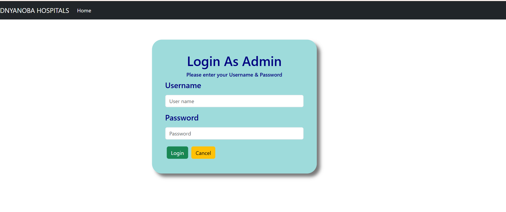
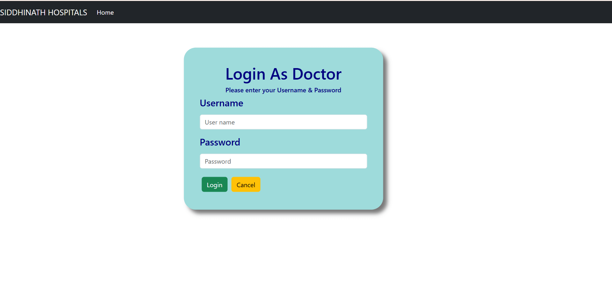
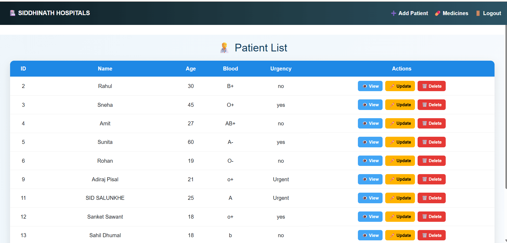
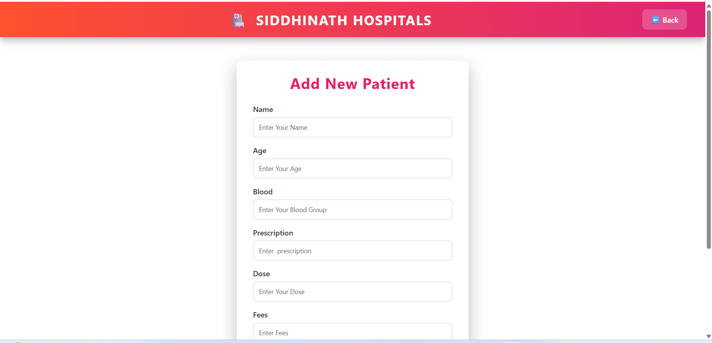
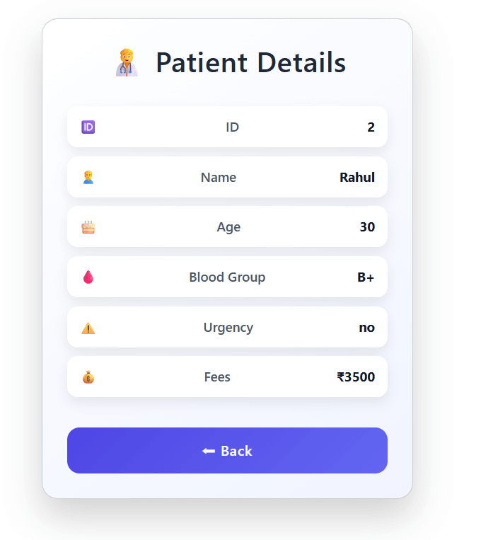
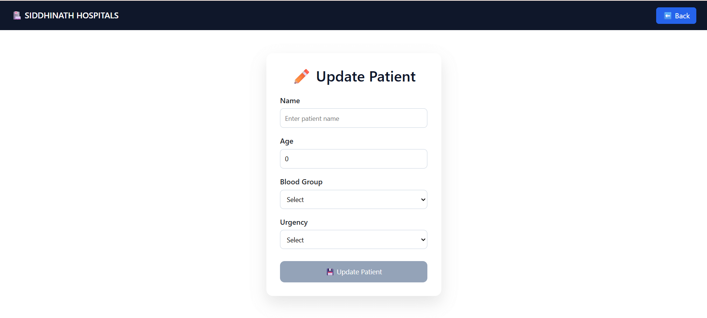
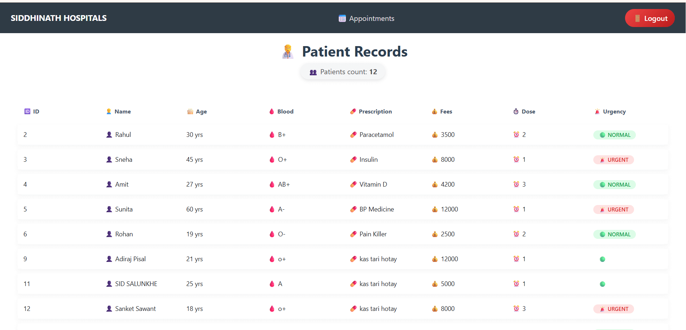
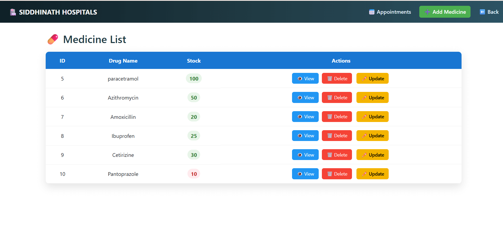
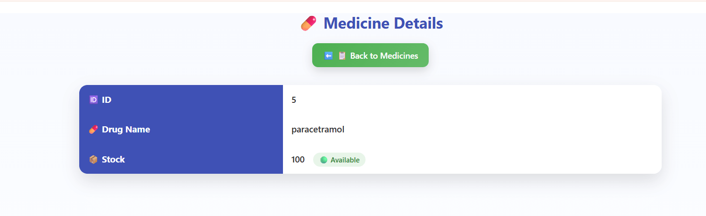
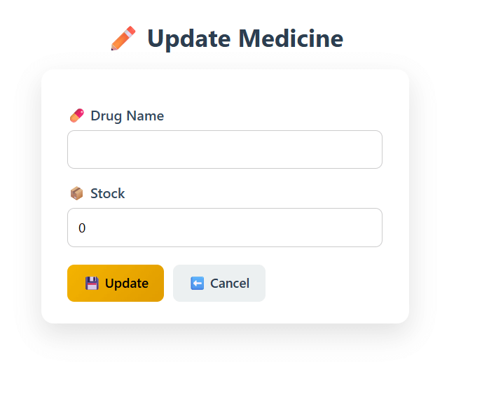

# 🏥 Hospital Management System

🚀 **Full Stack Hospital Management System**  
Built using **Angular (Frontend)** + **Spring Boot (Backend)**  
Secure • Scalable • Role Based Login

---

## 🔐 Demo Login Credentials

### 👑 Admin Login
- **Username:** `admin`
- **Password:** `1212`

### 👨‍⚕️ Doctor Login
- **Username:** `pratik`
- **Password:** `pratik2004`

> ⚠️ These credentials are for demo/testing purpose only.

---

## ✨ Features

- 🔐 Secure Login (JWT Authentication)
- 👑 Admin Dashboard
- 👨‍⚕️ Doctor Dashboard
- 🧑‍⚕️ Patient Management
- 💊 Medicine Management
- 📋 Patient Records
- 📅 Appointments Handling
- 🔒 Role Based Access Control

---

## 🛠️ Tech Stack

### Frontend
- ⚡ Angular
- 🎨 Bootstrap / Custom CSS
- 🌐 REST API Integration

### Backend
- ☕ Java
- 🌱 Spring Boot
- 🔐 Spring Security + JWT
- 🗄️ MySQL

---

## 🖼️ Application Screenshots

### 🔐 Admin Login


---

### 👨‍⚕️ Doctor Login


---

### 🧑‍⚕️ Patient List


---

### ➕ Add Patient


---

### 👁️ View Patient


---

### ✏️ Update Patient


---

### 📋 Patient Record


---

### 💊 Medicine List


---

### 📄 Medicine Details


---

### ✏️ Update Medicine



## ▶️ How to Run Project

### 1️⃣ Clone Repository
```bash
git clone https://github.com/Pratik476/hospital-management-system.git
